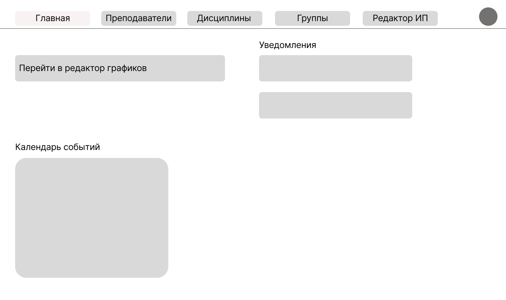
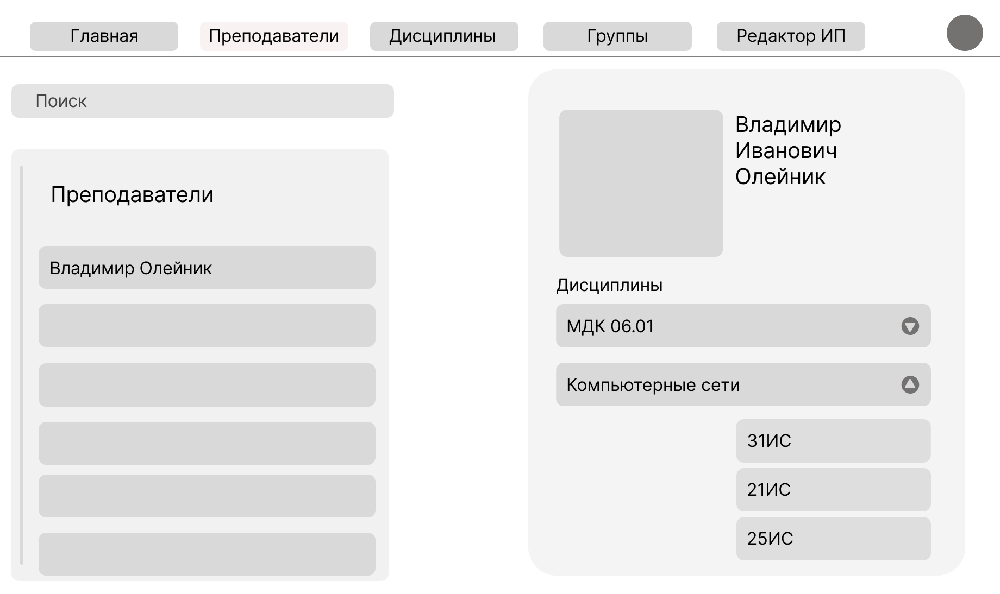
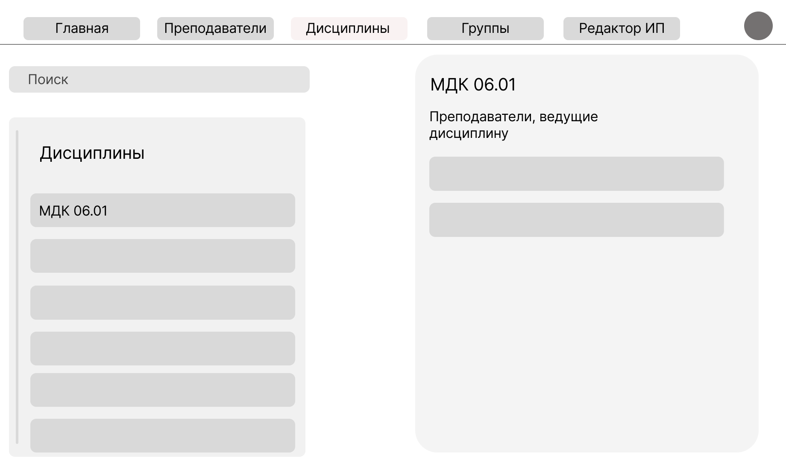
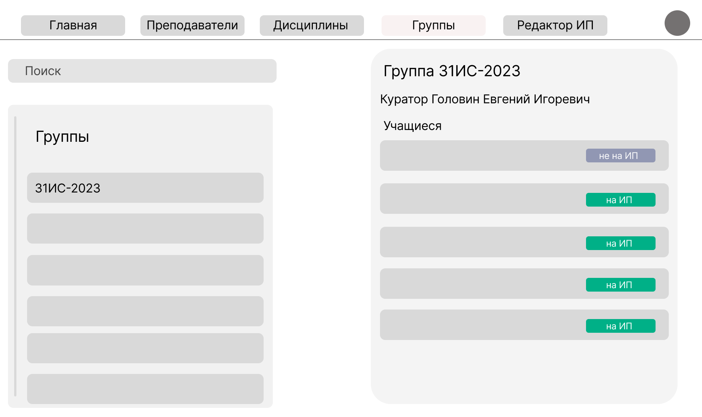
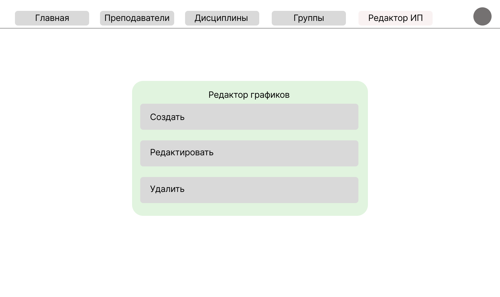
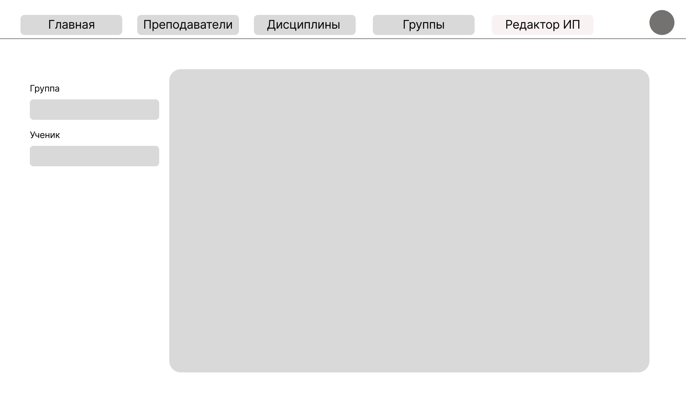

Сайт для оформление индивидуальных планов для учащихся СПО.

### Общие сведения

**Цель проекта:** Автоматизация процесса создания, согласования и контроля исполнения индивидуальных учебных планов (ИП) для учащихся, выбывших на индивидуальное обучение.  
**Целевая аудитория:** учебная часть, преподаватели, учащиеся.

#### Сценарии использования

1. **Инициация:** Администратор создает карточку учащегося, переводит его в статус «На ИП».
2. **Планирование:** Администратор формирует структуру ИП (список дисциплин и сроки).
3. **Назначение задач:** Преподаватели, закрепленные за дисциплинами в ИП, получают уведомление и добавляют конкретные задания/контрольные точки.
4. **Исполнение:** Учащийся получает уведомление, видит задания
5. **Контроль:** Преподаватель проверяет выполнение, Администратор мониторит общий прогресс.

#### Ролевая модель и права доступа

1. Администратор (Учебная часть)
    * **Доступ:** Полный доступ ко всем разделам системы.
    * Функции:
        * Управление пользователями (CRUD: создание, чтение, обновление, удаление) для ролей «Преподаватель» и «Учащийся».
        * Управление справочниками: Группы, Дисциплины, Учебные периоды.
        * Создание и редактирование Индивидуальных Планов (ИП).
        * Изменение статуса учащегося (например: «Обучается», «На ИП», «Академический отпуск»).
        * Просмотр статистики по всем ИП.
        * Редактирование собственного профиля.
2. Преподаватель
    * Доступ: Ограниченный (только свои предметы и студенты на ИП).
    * Функции:
        * Просмотр списка учащихся, находящихся на ИП, по закрепленным дисциплинам.
        * Добавление/редактирование заданий в рамках ИП учащегося.
        * Отметка о выполнении задания студентом (Зачтено / Не зачтено).
        * Просмотр и редактирование собственного профиля.
3. Учащийся
    * Доступ: Личный кабинет (только свои данные).
    * Функции:
        * Просмотр своего Индивидуального Плана и графика.
        * Просмотр списка заданий от преподавателей.
        * Загрузка файлов выполнения заданий.
        * Отслеживание статуса выполнения (Сдано / На проверке).
        * Просмотр и редактирование собственного профиля.

### Функциональные требования

1. Авторизация и Профиль
    * Вход: По логину и паролю. Логин/пароль первоначально выдаются Администратором.
    * Восстановление доступа: Функция «Забыли пароль?» (сброс на привязанную электронную почту).
    * Смена пароля: Доступна для всех ролей в личном кабинете.
    * Профиль пользователя («Визитная карточка»):
        * Общие поля: Роль, Фото, ФИО, Телефон, E-mail.
        * Спец. поля (Учащийся): Группа, Куратор группы.
        * Обязательное заполнение: при первом входе система принудительно предлагает заполнить недостающие обязательные поля (ФИО, Телефон). Для учащихся также Группа и Куратор.
2. Управление Индивидуальными Планами (ИП)
    * Администратор выбирает учащегося из списка и активирует режим «ИП».
    * В режиме ИП формируется график: выбираются дисциплины, устанавливаются сроки сдачи.
    * Система автоматически определяет преподавателей (можно редактировать по необходимости) по дисциплинам и отправляет им уведомление.
3. Уведомления
    * Каналы: Внутренние уведомления (колокольчик в интерфейсе) + E-mail рассылка.
    * Триггеры:
        * Учащемуся: Статус ИП изменен на «Активен», Добавлено новое задание.
        * Преподавателю: Учащийся переведен на ИП по его предмету, Студент загрузил задание на проверку.
        * Администратору: Критические ошибки системы.
4. Интерфейс и Навигация
    * Адаптивная верстка: корректное отображение на ПК, планшетах и смартфонах.
    * Меню навигации должно соответствовать роли пользователя.
    * Поиск и фильтрация списков (по фамилии, группе, статусу).

#### Нефункциональные требования

**Производительность:** Время отклика от программы не больше секунды.  
**Безопасность:** Зашита от DDoS, права доступа для каждой роли, бэкап базы данных.  
**Нагрузка:** система должна выдерживать без особых осложнений 30 одновременных пользователей.  
**Совместимость:** сайт должен открываться во всех браузерах, как на PC, так и на смартфонах.  
**Язык интерфейса:** русский  

#### Дизайн и интерфейс

